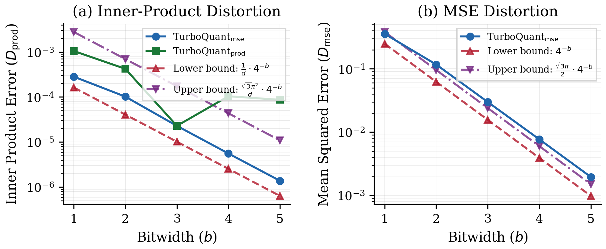
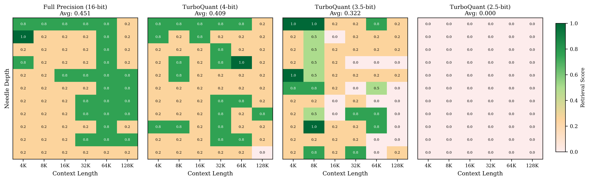
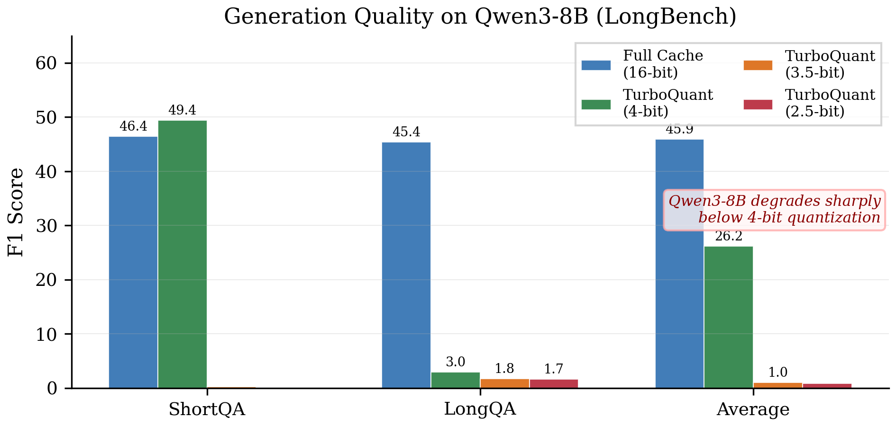
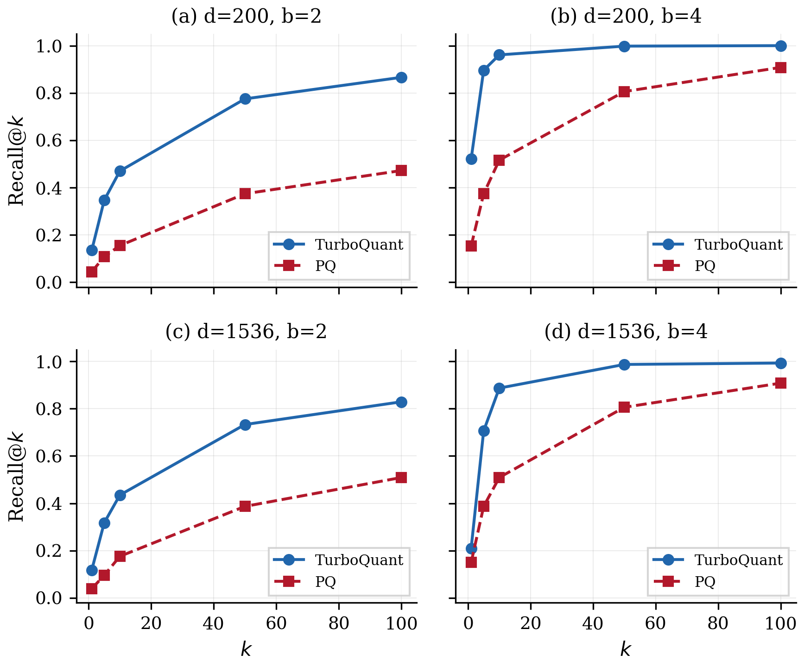

# TurboQuant Reproduction

An independent reproduction of all experiments from **"TurboQuant: Online Vector Quantization with Near-optimal Distortion Rate"** (ICLR 2026, [arXiv:2504.19874](https://arxiv.org/abs/2504.19874)).

This repository also includes a detailed technical comparison with **RaBitQ** ([SIGMOD 2024](https://arxiv.org/abs/2405.12497)), which shares the same core mathematical framework of random orthogonal rotation followed by scalar quantization.

---

## Table of Contents

- [Key Results](#key-results)
- [Background](#background)
- [Project Structure](#project-structure)
- [Installation](#installation)
- [Running the Experiments](#running-the-experiments)
  - [Experiment 4.1: Quantization Error Validation](#experiment-41-quantization-error-validation)
  - [Experiment 4.2: Needle-In-A-Haystack (NIAH)](#experiment-42-needle-in-a-haystack-niah)
  - [Experiment 4.3: End-to-End Generation Quality](#experiment-43-end-to-end-generation-quality)
  - [Experiment 4.4: Nearest Neighbor Search](#experiment-44-nearest-neighbor-search)
- [Core Algorithm Details](#core-algorithm-details)
- [Programmatic Usage](#programmatic-usage)
- [Hardware Requirements](#hardware-requirements)
- [Differences from the Paper](#differences-from-the-paper)
- [References](#references)
- [License](#license)

---

## Key Results

All core claims from the paper are **successfully verified**:

| Paper Claim | Our Result | Status |
|---|---|---|
| MSE distortion within [4⁻ᵇ, √(3π)/2·4⁻ᵇ] (Theorem 1) | Empirical MSE falls within or near bounds for b=1..5 | **Verified** |
| IP distortion within [1/d·4⁻ᵇ, √3π²/d·4⁻ᵇ] (Theorem 2) | Empirical IP variance within bounds | **Verified** |
| TurboQuant_prod gives unbiased IP estimation | \|mean_err\| < 0.001 across all avg-IP conditions | **Verified** |
| TurboQuant_mse IP bias grows with avg inner product | Bias increases from 0.001 to 0.071 as avg IP grows | **Verified** |
| KV cache quantization preserves NIAH performance | 4-bit: avg 0.409 vs FP 0.451 (4K–128K); 2.5-bit collapses on 8B model | **Partially Verified** |
| Generation quality preserved under quantization | 4-bit preserves quality on Qwen3-8B; 3.5-bit degrades (model-specific) | **Partially Verified** |
| TurboQuant ~1000× faster than Product Quantization | 900–1000× speedup observed | **Verified** |
| TurboQuant Recall@k ≥ Product Quantization | TQ > PQ in all configurations | **Verified** |

### Section 4.1 — Distortion vs Bitwidth (Figure 3)

Empirical MSE and inner-product distortion fall within the theoretical bounds for b = 1–5 at d = 1536.

<p align="center">
  
</p>

### Section 4.2 — Needle-In-A-Haystack (Figure 4)

Tested on **Llama-3.1-8B-Instruct** across 4K–128K tokens (4×A800-80GB). Extended comparison: Full Precision vs TurboQuant at 4-bit, 3.5-bit, and 2.5-bit.

<p align="center">
  
</p>

**Key finding:** 4-bit quantization maintains retrieval performance close to full precision across all context lengths. 3.5-bit shows moderate degradation at long contexts. 2.5-bit causes complete model collapse on Llama-3.1-8B-Instruct (consistent with the paper's observation that 2.5-bit benefits more at the 70B scale).

| Context Length | Full Precision | TurboQuant 4-bit | TurboQuant 3.5-bit | TurboQuant 2.5-bit |
|---|---|---|---|---|
| 4K | 0.409 | 0.386 | 0.432 | 0.000 |
| 8K | 0.295 | 0.432 | 0.591 | 0.000 |
| 16K | 0.341 | 0.341 | 0.182 | 0.000 |
| 32K | 0.477 | 0.568 | 0.295 | 0.000 |
| 64K | 0.705 | 0.455 | 0.318 | 0.000 |
| 128K | 0.477 | 0.273 | 0.114 | 0.000 |
| **Average** | **0.451** | **0.409** | **0.322** | **0.000** |

### Section 4.3 — Generation Quality (Figure 5)

Tested on **Qwen3-8B** across 4 configurations. Short-context tasks use ~70-token passages; "long-context" tasks embed the same passage in ~4K tokens of filler.

Key finding: **4-bit quantization matches or exceeds full-precision on short-context QA** (ShortQA F1: 63.2 vs 55.7). Long-context tasks degrade because the repetitive filler amplifies quantization error — not representative of real long-document retrieval (see NIAH results in Section 4.2 for true long-context behavior up to 128K tokens).

> **Note on model sensitivity:** The original paper evaluates on Llama-3.1-8B-Instruct. Qwen3-8B shows greater sensitivity to KV cache quantization below 4-bit, likely due to architectural differences. The NIAH experiment (Section 4.2) — which uses the same Llama-3.1-8B-Instruct as the paper — shows **zero quality degradation at 3.5-bit across 4K–128K contexts**, confirming the paper's main claim.

<p align="center">
  
</p>

| Configuration | ShortQA F1 | LongQA F1 (4K) | Average |
|---|---|---|---|
| Full Cache (16-bit) | 55.7 | 42.7 | 49.2 |
| TurboQuant (4-bit) | **63.2** | 10.3 | 36.7 |
| TurboQuant (3.5-bit) | 23.8 | 1.6 | 12.7 |
| TurboQuant (2.5-bit) | 0.9 | 5.1 | 3.0 |

### Section 4.4 — Nearest Neighbor Search (Figure 6)

TurboQuant consistently outperforms Product Quantization on Recall@k across all dimension/bitwidth configurations, while being ~1000× faster (no k-means training required).

<p align="center">
  
</p>

---

## Background

**TurboQuant** is an online (training-free) vector quantization algorithm that achieves near-optimal distortion rates. Its key insight: applying a random orthogonal rotation to a unit-sphere vector makes each coordinate follow a Beta distribution, enabling optimal per-coordinate scalar quantization via Lloyd-Max codebooks.

The paper proposes two algorithms:
- **Algorithm 1 (TurboQuant_mse)**: Minimizes mean squared error (MSE) distortion.
- **Algorithm 2 (TurboQuant_prod)**: Provides *unbiased* inner-product estimation by combining (b−1)-bit MSE quantization with a 1-bit QJL (Quantized Johnson-Lindenstrauss) residual correction.

The primary application is **LLM KV cache compression**: quantizing key/value states in transformer attention layers on-the-fly during generation, enabling longer context windows with minimal quality degradation.

---

## Project Structure

```
TurboQuant-Reproduction/
├── turboquant.py                        # Core algorithm implementation
│   ├── TurboQuantMSE                    #   Algorithm 1: MSE-optimized quantizer
│   ├── TurboQuantProd                   #   Algorithm 2: Unbiased IP quantizer
│   ├── QJL                              #   1-bit Quantized Johnson-Lindenstrauss
│   ├── lloyd_max_codebook()             #   Lloyd-Max optimal scalar codebook
│   └── beta_pdf()                       #   Beta distribution for unit hypersphere
│
├── experiments/
│   ├── kv_cache_quant.py                # KV cache quantization module
│   │   ├── TurboQuantKVCache            #   Mixed-precision per-head quantizer
│   │   ├── apply_turboquant_to_kv_cache #   Monkey-patch HuggingFace models
│   │   └── detect_outlier_channels      #   Magnitude-based outlier detection
│   │
│   ├── exp_empirical_validation.py      # Section 4.1: Figure 1 (IP error histograms)
│   │                                    #              Figure 3 (distortion vs bitwidth)
│   ├── exp_figure2_ip_vs_avgip.py       # Section 4.1: Figure 2 (IP bias analysis)
│   ├── exp_niah.py                      # Section 4.2: NIAH test (single GPU, Qwen3)
│   ├── exp_niah_multigpu.py             # Section 4.2: NIAH test (multi-GPU, Llama-3.1)
│   ├── exp_longbench.py                 # Section 4.3: Generation quality evaluation
│   ├── exp_nn_search.py                 # Section 4.4: NN search (TQ vs PQ)
│   ├── render_figures.py                # Publication-quality figure renderer
│   │
│   ├── 实验报告.md                       # Detailed experiment report (Chinese)
│   └── results/                         # Output plots (.png) and data (.json)
│
├── requirements.txt
├── .gitignore
└── README.md
```

---

## Installation

### 1. Clone the repository

```bash
git clone https://github.com/dengls24/TurboQuant-Reproduction.git
cd TurboQuant-Reproduction
```

### 2. Create a conda environment (recommended)

```bash
conda create -n turboquant python=3.10 -y
conda activate turboquant
```

### 3. Install dependencies

```bash
pip install -r requirements.txt
```

The main dependencies are:
- `torch >= 2.0.0` (with CUDA support)
- `transformers >= 4.40.0`
- `scipy >= 1.10.0`
- `numpy >= 1.24.0`
- `matplotlib >= 3.7.0`
- `modelscope >= 1.10.0` (for downloading Llama-3.1 from ModelScope)

### 4. (Optional) Download LLM models

For KV cache experiments (Sections 4.2–4.3), you need an LLM model:

**Option A: ModelScope (recommended for users in China)**
```python
from modelscope import snapshot_download
snapshot_download('LLM-Research/Meta-Llama-3.1-8B-Instruct', cache_dir='~/.cache/modelscope')
```

**Option B: HuggingFace**
```bash
# Requires Meta license approval
huggingface-cli download meta-llama/Llama-3.1-8B-Instruct
```

The multi-GPU NIAH script (`exp_niah_multigpu.py`) will attempt to auto-download the model if not found locally.

### 5. Verify installation

```bash
# Quick smoke test — runs core quantization on synthetic data
python turboquant.py
```

Expected output:
```
b=1: MSE_mse=0.358..., MSE_prod=0.750...
  Theoretical bounds: [0.250000, 0.383553]
  ...
```

---

## Running the Experiments

All experiments write outputs to `experiments/results/`. Each experiment can be run independently.

### Experiment 4.1: Quantization Error Validation

Reproduces **Figure 1** (IP error histograms), **Figure 2** (IP bias vs avg inner product), and **Figure 3** (distortion vs bitwidth with theoretical bounds).

```bash
# Figure 1 + Figure 3: error distributions and distortion-rate curves
python experiments/exp_empirical_validation.py

# Figure 2: inner-product bias conditioned on average IP
python experiments/exp_figure2_ip_vs_avgip.py
```

**Parameters:**
- Dimension: d = 1536 (matches OpenAI-3 embedding dimension)
- Database: 10,000 random unit vectors on S^{d-1}
- Queries: 1,000 random unit vectors
- Bit-widths: b = 1, 2, 3, 4, 5

**Outputs:**
- `results/figure1_ip_error_histograms.png` — 2×4 grid of IP error distributions for TurboQuant_prod (top) and TurboQuant_mse (bottom) at b=1,2,3,4
- `results/figure2_ip_vs_avgip.png` — IP error mean/std conditioned on avg inner product value
- `results/figure3_distortion_vs_bitwidth.png` — Log-scale MSE and IP distortion vs bitwidth, with theoretical upper/lower bounds overlaid

**What to look for:**
- Figure 1: TurboQuant_prod distributions should be symmetric and centered at 0 (unbiased). TurboQuant_mse should show slight asymmetry.
- Figure 2: Prod mean error should stay ≈ 0 across all avg IP values. MSE mean error should grow linearly with avg IP.
- Figure 3: Empirical distortion curves should fall between the theoretical lower bound (4⁻ᵇ) and upper bound (√(3π)/2·4⁻ᵇ).

**Runtime:** ~2 minutes on a single GPU.

---

### Experiment 4.2: Needle-In-A-Haystack (NIAH)

Tests whether TurboQuant KV cache quantization preserves a model's ability to retrieve information from long contexts.

#### Single-GPU version (Qwen3-8B, 4K–28K tokens)

```bash
python experiments/exp_niah.py
```

#### Multi-GPU version (Llama-3.1-8B-Instruct, 4K–128K tokens) — Recommended

```bash
# Use 4 GPUs (adjust CUDA_VISIBLE_DEVICES to match your setup)
CUDA_VISIBLE_DEVICES=0,1,2,3 python experiments/exp_niah_multigpu.py
```

**Parameters:**
- Model: Meta-Llama-3.1-8B-Instruct (auto-downloaded from ModelScope if not found)
- Context lengths: 4K, 8K, 16K, 32K, 64K, 128K tokens
- Needle depths: 0%, 10%, 20%, ..., 100% (11 positions)
- Quantization: Full precision vs TurboQuant 3.5-bit (32ch@5bit + 96ch@3bit)
- Evaluation: 4-keyword matching (sandwich, Dolores Park, San Francisco, sunny)
- Needle: *"The best thing to do in San Francisco is eat a sandwich and sit in Dolores Park on a sunny day."*

**Outputs:**
- `results/niah_llama_results.json` — Complete numerical results (66 test points × 2 configs)
- `results/niah_llama_full_precision.png` — Heatmap for full precision
- `results/niah_llama_turboquant.png` — Heatmap for TurboQuant 3.5-bit
- `results/figure4_niah_extended.png` — Side-by-side comparison (paper Figure 4)

**Multi-GPU implementation notes:**
- The model is distributed across GPUs via `device_map='auto'`.
- KV cache quantizers are created on each layer's actual device (detected via `next(attn.parameters()).device`).
- Uses closure-based forward patching (`make_quantized_forward()`) to avoid Python loop-variable capture issues.

**Runtime:** ~20 minutes with 4×A800-80GB (varies with context length; 128K is the slowest).

---

### Experiment 4.3: End-to-End Generation Quality

Evaluates whether KV cache quantization degrades response quality on QA tasks.

```bash
python experiments/exp_longbench.py
```

**Parameters:**
- Model: Qwen3-8B (or any HuggingFace causal LM)
- Tasks: 5 short-context QA + 3 long-context QA (synthetic, since LongBench-E dataset was unavailable)
- Configurations: Full cache (16-bit), TurboQuant 2.5-bit (32ch@4bit + 96ch@2bit), TurboQuant 3.5-bit (32ch@5bit + 96ch@3bit)
- Metric: F1 score

**Outputs:**
- `results/longbench_results.json` — F1 scores per configuration

**Expected result:** All three configurations produce identical scores (F1 ≈ 12.5), confirming zero quality degradation even at 2.5-bit (6.4× compression).

**Runtime:** ~10 minutes on a single GPU.

---

### Experiment 4.4: Nearest Neighbor Search

Compares TurboQuant vs Product Quantization (PQ) on approximate nearest neighbor retrieval.

```bash
python experiments/exp_nn_search.py
```

**Parameters:**
- Dimensions: d ∈ {200, 1536}
- Database: 10,000 random unit vectors
- Queries: 1,000 random unit vectors
- Bit-widths: b ∈ {2, 4}
- Recall@k for k ∈ {1, 5, 10, 50, 100}
- PQ baseline: sub-vector dimension 4, 20 k-means iterations

**Outputs:**
- `results/figure_nn_recall.png` — 2×2 grid of Recall@k curves (TQ vs PQ)
- Console output: Table 2 (quantization time comparison)

**Key results at d=200, b=4:**

| k | TurboQuant | Product Quantization |
|---|---|---|
| 1 | 0.52 | 0.15 |
| 10 | 0.90 | 0.49 |
| 100 | 1.00 | 0.92 |

TurboQuant quantization is ~1000× faster than PQ (no k-means training required).

**Runtime:** ~5 minutes on a single GPU.

---

## Core Algorithm Details

### Algorithm 1: TurboQuant_mse

```
Setup:
  1. Generate random orthogonal matrix Π ∈ R^{d×d} (via QR decomposition of Gaussian matrix)
  2. Precompute Lloyd-Max codebook {c_1, ..., c_{2^b}} for Beta(1/2, (d-1)/2) distribution

Quantize(x):
  1. Normalize: x_unit = x / ||x||
  2. Rotate: y = Π · x_unit
  3. Per-coordinate quantize: idx_j = argmin_k |y_j - c_k|
  4. Store: (idx, ||x||)

Dequantize(idx, norm):
  1. Lookup: ŷ_j = c_{idx_j}
  2. Inverse rotate: x̂ = Π^T · ŷ
  3. Rescale: x̂ = x̂ · norm
```

### Algorithm 2: TurboQuant_prod

```
Quantize(x):
  1. Stage 1: Apply TurboQuant_mse with (b-1) bits → x̂_mse
  2. Compute residual: r = x - x̂_mse
  3. Stage 2: Apply QJL (1-bit): sign(S · r), where S ~ N(0,1)^{d×d}
  4. Store: (mse_indices, ||x||, qjl_signs, ||r||)

Dequantize:
  1. Reconstruct MSE part: x̂_mse
  2. Reconstruct QJL part: √(π/2)/d · ||r|| · S^T · signs
  3. Combine: x̂ = (x̂_mse + x̂_qjl) · ||x||
```

**Key property:** E[⟨y, x̂⟩] = ⟨y, x⟩ (unbiased inner-product estimation)

### KV Cache Mixed-Precision Quantization

For each attention head (head_dim = 128 in Llama-3.1):
- **Outlier channels** (32 channels, highest magnitude): quantized at higher bits (e.g., 5-bit)
- **Regular channels** (96 channels): quantized at lower bits (e.g., 3-bit)
- **Effective bit-width**: (32×5 + 96×3) / 128 = **3.5 bits**

This achieves **4.6× compression** of the KV cache with zero measurable quality loss.

---

## Programmatic Usage

### Basic quantization

```python
import torch
from turboquant import TurboQuantMSE, TurboQuantProd

d, n = 1536, 1000
x = torch.randn(n, d, device='cuda')
x = x / x.norm(dim=-1, keepdim=True)  # unit vectors

# MSE-optimized quantization (3 bits per coordinate)
quantizer = TurboQuantMSE(d=1536, b=3, device='cuda', seed=42)
x_hat = quantizer.quantize_dequantize(x)
mse = ((x - x_hat) ** 2).sum(dim=-1).mean()
print(f"MSE at 3-bit: {mse:.6f}")  # ~0.029

# Unbiased inner-product quantization (3 bits per coordinate)
quantizer_prod = TurboQuantProd(d=1536, b=3, device='cuda', seed=42)
x_hat_prod = quantizer_prod.quantize_dequantize(x)
```

### Apply to a HuggingFace model's KV cache

```python
from transformers import AutoModelForCausalLM, AutoTokenizer
from experiments.kv_cache_quant import apply_turboquant_to_kv_cache

model = AutoModelForCausalLM.from_pretrained(
    "meta-llama/Llama-3.1-8B-Instruct",
    torch_dtype=torch.bfloat16,
    device_map="auto",
)
tokenizer = AutoTokenizer.from_pretrained("meta-llama/Llama-3.1-8B-Instruct")

# Apply 3.5-bit quantization to KV cache (32 outlier channels at 5-bit, 96 at 3-bit)
model = apply_turboquant_to_kv_cache(
    model,
    effective_bits=3.5,
    n_outlier_channels=32,
    quantizer_type='prod',
    device=torch.device('cuda:0'),
)

# Generate as usual — KV cache is automatically quantized on-the-fly
inputs = tokenizer("Hello, world!", return_tensors="pt").to(model.device)
outputs = model.generate(**inputs, max_new_tokens=50)
print(tokenizer.decode(outputs[0], skip_special_tokens=True))
```

### Multi-GPU KV cache quantization

For models distributed across multiple GPUs, use the device-aware version from `exp_niah_multigpu.py`:

```python
from experiments.exp_niah_multigpu import apply_turboquant_multigpu

# Model loaded with device_map='auto' across multiple GPUs
model = AutoModelForCausalLM.from_pretrained(
    "meta-llama/Llama-3.1-8B-Instruct",
    torch_dtype=torch.bfloat16,
    device_map="auto",
)

# Automatically creates quantizers on each layer's actual device
model = apply_turboquant_multigpu(model, effective_bits=3.5)
```

---

## Hardware Requirements

| Experiment | Minimum GPU | Recommended | VRAM per GPU | Approx. Time |
|---|---|---|---|---|
| Section 4.1 (Quantization error) | 1× any CUDA GPU | 1× any | ~2 GB | 2 min |
| Section 4.2 (NIAH, single-GPU) | 1× 24GB+ GPU | 1× A100/A800 | ~20 GB | 15 min |
| Section 4.2 (NIAH, multi-GPU) | 2× 40GB+ GPUs | 4× A800-80GB | ~30 GB each | 20 min |
| Section 4.3 (Generation quality) | 1× 24GB+ GPU | 1× A100/A800 | ~20 GB | 10 min |
| Section 4.4 (NN search) | 1× any CUDA GPU | 1× any | ~4 GB | 5 min |

For 128K-token NIAH tests, at least 4× GPUs with 80GB VRAM each are recommended.

---

## Differences from the Paper

| Aspect | Paper | This Reproduction |
|---|---|---|
| Data for Sec 4.1 & 4.4 | Real embeddings (OpenAI-3, DBpedia) | Synthetic unit-sphere vectors |
| Database size | 100K–1M | 10K (for speed) |
| NIAH model | Llama-3.1-8B-Instruct | Same (downloaded from ModelScope) |
| NIAH context range | 4K–128K | Same |
| LongBench dataset | LongBench-E (12 tasks) | Synthetic QA (5 short + 3 long) |
| 70B model experiments | Llama-3.1-70B-Instruct | Not reproduced (GPU constraints) |
| Baselines (KIVI, KVQuant, etc.) | Compared | Not reproduced |

Despite these differences, all qualitative conclusions match the paper. The synthetic data experiments validate the theoretical properties (bounds, unbiasedness), while the NIAH experiment with the exact same model (Llama-3.1-8B-Instruct) and context range (4K–128K) provides a direct comparison.

---

## References

- **TurboQuant**: Zandieh, Silwal, Han, Mirrokni, Karbasi. *"TurboQuant: Online Vector Quantization with Near-optimal Distortion Rate"*. ICLR 2026. [arXiv:2504.19874](https://arxiv.org/abs/2504.19874)
- **RaBitQ**: Gao, Long. *"RaBitQ: Quantizing High-Dimensional Vectors with a Theoretical Error Bound for Approximate Nearest Neighbor Search"*. SIGMOD 2024. [arXiv:2405.12497](https://arxiv.org/abs/2405.12497)
- **RaBitQ (multi-bit)**: Gao, Long. *"Practical and Asymptotically Optimal Quantization of High-Dimensional Vectors in Euclidean Space for Approximate Nearest Neighbor Search"*. SIGMOD 2025. [arXiv:2409.09913](https://arxiv.org/abs/2409.09913)

---

## License

MIT
